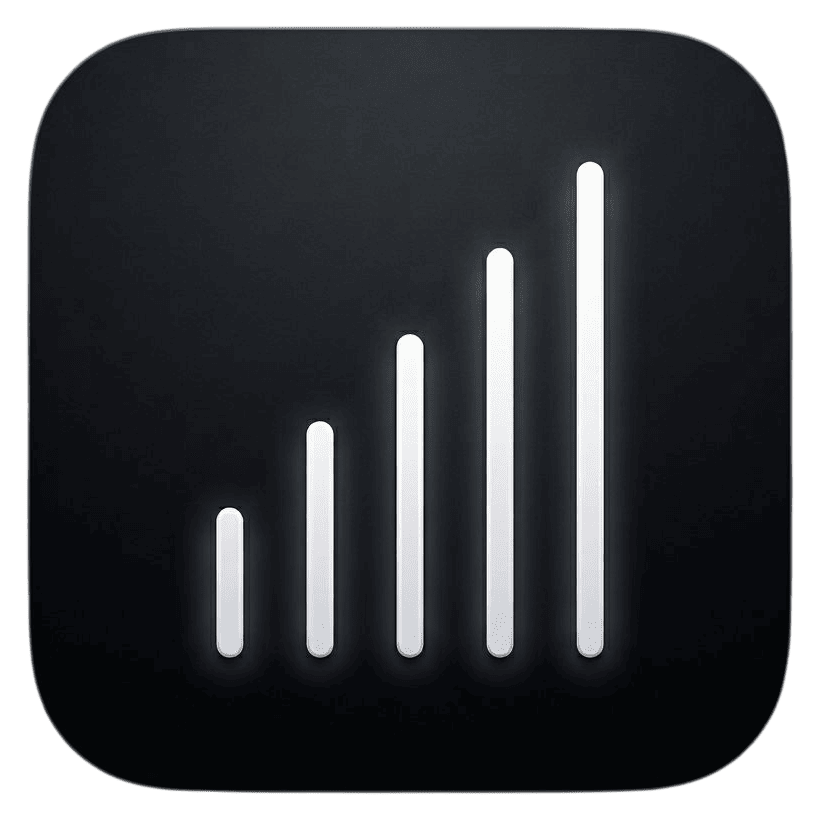
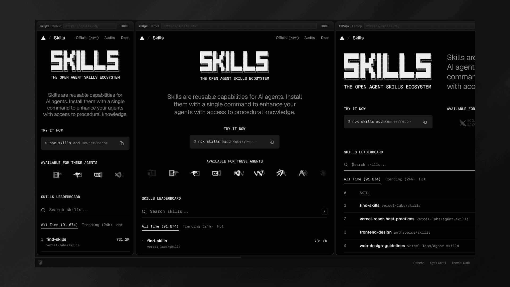

<p align="center">
  
</p>

<h1 align="center">breakpoint-preview</h1>

<p align="center">
  <a href="https://www.npmjs.com/package/breakpoint-preview"></a>
  
  <a href="https://github.com/enisbu/breakpoint-preview/blob/master/LICENSE"></a>
</p>

<p align="center">
  <strong>See all breakpoints at once.</strong><br/>
  Zero dependencies. Works with any framework.<br/>
  Preview your site at every viewport width side by side — mobile, tablet, laptop, desktop.
</p>

<p align="center">
  <code>npx breakpoint-preview http://localhost:5173</code>
</p>

<p align="center">
  
</p>

---

## Features

- **Multi-Viewport Preview**: See 375px, 768px, 1024px, 1440px side by side. No more tab switching.
- **Per-Viewport URL Bar**: Type a path, hit Enter. Each viewport navigates independently.
- **Hide/Show Viewports**: Collapse what you don't need. Click to restore. State persists across reloads.
- **Scroll Sync**: Toggle synchronized scrolling across all viewports from the settings popover.
- **HMR Pass-Through**: Vite, Webpack, Next.js, SvelteKit. Hot reload just works.
- **Standalone Window**: `--app` opens in Chrome/Chromium without browser UI.
- **Custom Breakpoints**: Define any widths you want.
- **Zero Dependencies**: Just Node.js.

---

## Quick Start

```bash
npx breakpoint-preview http://localhost:5173
```

Or install globally:

```bash
npm install -g breakpoint-preview
breakpoint-preview http://localhost:5173
```

As an AI agent skill:

```bash
npx skills add enisbu/breakpoint-preview
```

---

## Usage

```bash
# Preview a dev server (http or https)
breakpoint-preview http://localhost:5173

# Standalone window (no browser chrome)
breakpoint-preview http://localhost:5173 --app

# Custom breakpoints
breakpoint-preview http://localhost:5173 --breakpoints 320,768,1024,1920

# Custom port
breakpoint-preview http://localhost:5173 --port 9000

# Static files
breakpoint-preview ./dist/index.html
```

---

## How It Works

A local proxy server forwards all requests to your dev server. This makes all viewports same-origin, enabling scroll sync and per-viewport URL tracking. WebSocket connections (HMR) are passed through transparently. No browser extensions. No config files. No dependencies.

---

## Works With

Any framework that runs a dev server: **Vite**, **Next.js**, **Nuxt**, **SvelteKit**, **Astro**, **Remix**, **Gatsby**, plain HTML. HTTP and HTTPS URLs are both supported. If it has a URL, it works.

---

## AI Agent Support

Includes a [`SKILL.md`](SKILL.md) so AI coding agents (Claude Code, Codex, etc.) can discover and use it automatically. Agents can launch the preview, navigate viewports, and check responsive behavior on your behalf.

---

## Community & Contributing

- **Feedback & Ideas:** Missing something? [Open an issue](https://github.com/enisbu/breakpoint-preview/issues).
- **Contributing:** PRs welcome. Please open an issue first to discuss larger changes.

---

## License

[MIT](LICENSE)
